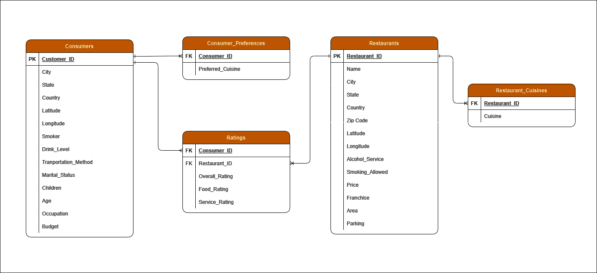
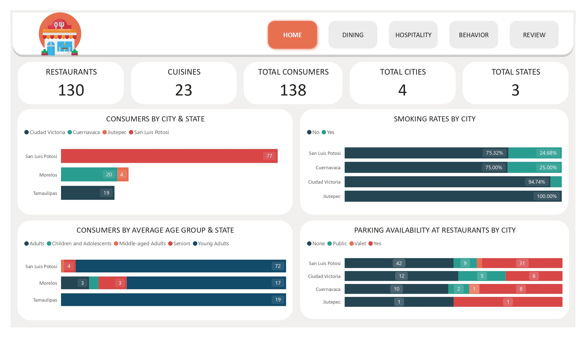
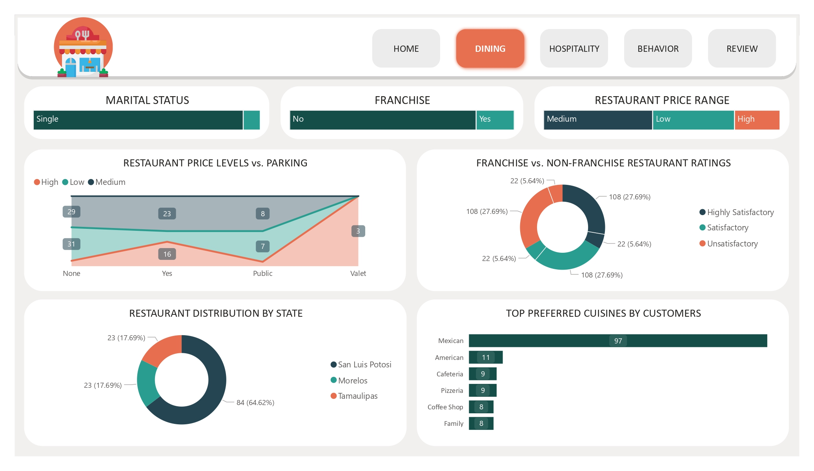
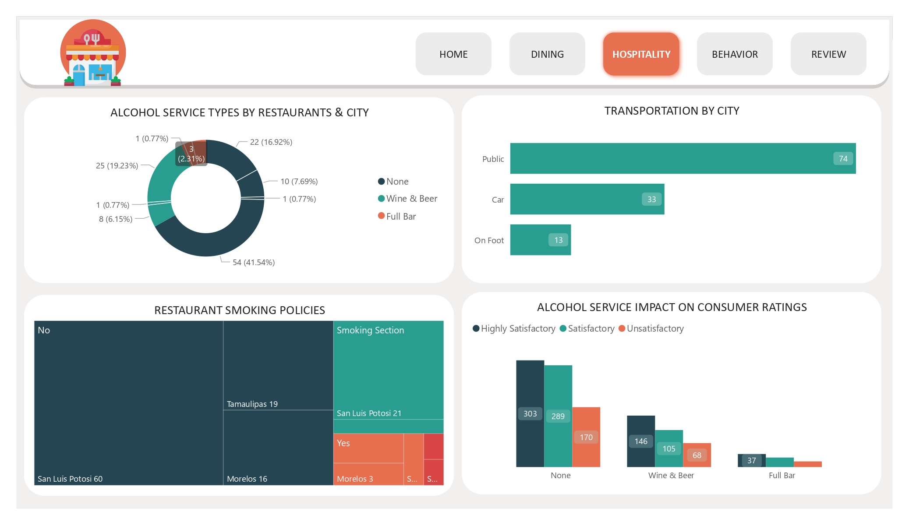
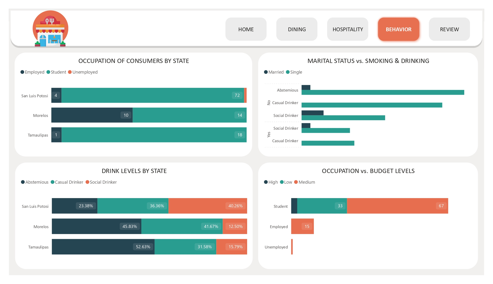
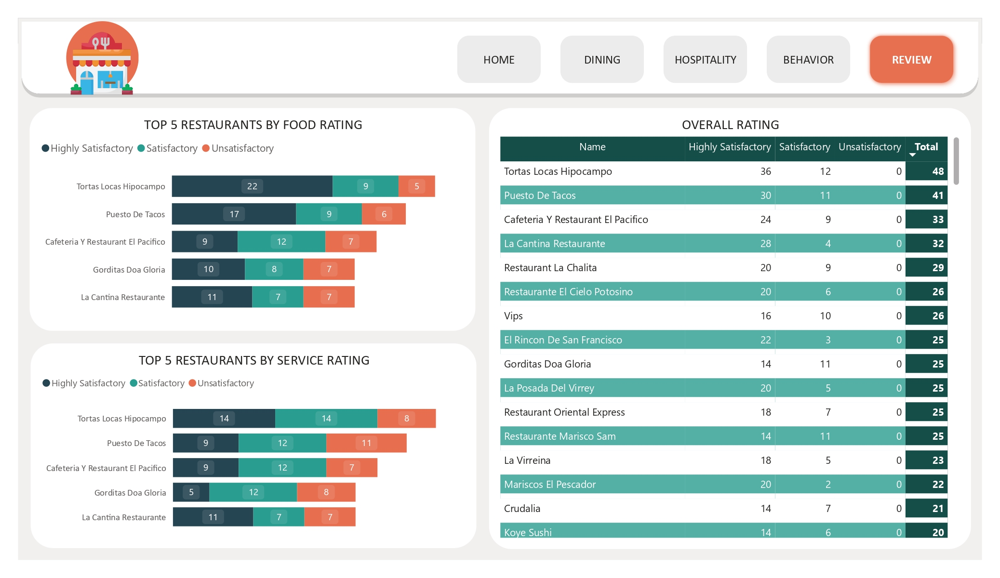

# Mexican Restaurant Consumer Analysis

## Project Overview
This project analyzes consumer behavior and restaurant ratings across Mexico, focusing on the relationship between demographic factors (age, location, budget) and dining preferences. By leveraging a dataset of real consumer reviews from 2012, this analysis uncovers key insights into market trends, cuisine popularity, and the impact of service amenities on customer satisfaction.

The goal is to provide actionable intelligence for restaurant owners and market analysts looking to understand the Mexican dining landscape.

## Data Structure
The analysis is based on a relational dataset comprising consumer profiles, restaurant details, and their subsequent interactions (ratings).

### 1. Consumer Profile (`consumers.csv`)
*   **Demographics:** Age, Marital Status, Children, Occupation.
*   **Location:** City, State, Latitude, Longitude.
*   **Lifestyle:** Smoker status, Drink level (Abstemious, Casual, Social), Transportation method.
*   **Economic:** Budget (Low, Medium, High).

### 2. Restaurant Profile (`restaurants.csv` & `restaurant_cuisines.csv`)
*   **Details:** Name, Location (City, State), Alcohol Service, Smoking Policy.
*   **Amenities:** Parking availability, Franchise status, Price range.
*   **Cuisine:** Specific types of food served.

### 3. Interaction Data (`ratings.csv`)
*   **Metrics:** Overall Rating, Food Rating, Service Rating (Scale: 0-2).

## Methodology & Data Transformation
The raw data was imported and transformed using **Power BI** to ensure accuracy and consistency.

1.  **Data Modeling:** An Entity-Relationship (ER) model was built to link consumers, restaurants, and ratings effectively.
2.  **Feature Engineering:**
    *   **Age Groups:** Segmented consumers into categories (e.g., "Young Adults" <= 30, "Seniors" > 60) for demographic analysis.
    *   **Rating Categories:** Mapped numerical ratings (0, 1, 2) to descriptive labels (Unsatisfactory, Satisfactory, Highly Satisfactory).
3.  **Data Cleaning:** Handled missing values and standardized categorical variables across files.

## Key Insights

### 📍 Geographic & Demographic Trends
*   **Population Centers:** The majority of the consumer base is located in San Luis Potosí, followed by Cuernavaca.
*   **Age Distribution:** "Young Adults" (under 30) are the dominant demographic across all states. However, San Luis Potosí and Morelos also show a significant population of "Seniors" (60+).
*   **Occupation:** The dataset is heavily skewed towards students, particularly in San Luis Potosí (93%) and Tamaulipas (94%).

### 🍽️ Dining Preferences & Habits
*   **Cuisine:** Mexican cuisine is the clear favorite, with American cuisine ranking second.
*   **Alcohol Consumption:**
    *   **San Luis Potosí:** Higher prevalence of social (40%) and casual drinkers.
    *   **Tamaulipas:** Predominantly abstemious (52%).
*   **Smoking:** The vast majority of consumers are non-smokers. Jiutepec represents a unique market with a 100% non-smoking consumer base.

### 🏢 Restaurant Amenities & Service
*   **Parking vs. Price:** There is a strong correlation between high price points and parking availability. All 16 high-priced restaurants offer parking (including valet), whereas budget-friendly options often lack these facilities.
*   **Alcohol Availability:** Approximately 67% of restaurants do not serve alcohol. Only ~7% offer a full bar service.
*   **Smoking Policies:** 73% of restaurants maintain a strict smoke-free environment.

### ⭐ Customer Satisfaction
*   **Top Performers:** *Tortas Locas Hipocampo* and *Puesto de Tacos* consistently rank highest across Food, Service, and Overall ratings.
*   **Impact of Alcohol:** Interestingly, non-drinkers provided the highest number of "Highly Satisfactory" ratings (303), suggesting that food quality and basic service are more critical drivers of satisfaction than alcohol availability.

## Dashboards
The following visualizations provide a deep dive into the analyzed metrics.

### Overview

### Demographics Analysis

### Cuisine Analysis

### Ratings Breakdown

### Restaurant Profile

## Tools Used
*   **Power BI:** Data visualization and dashboarding.
*   **Data Sources:** Publicly available restaurant datasets.